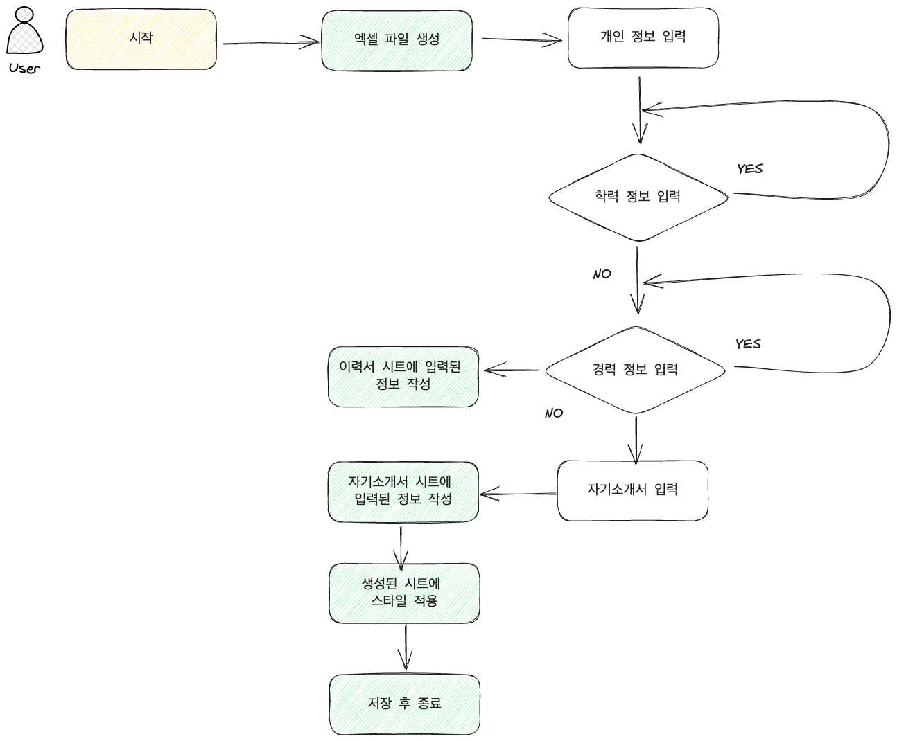

## 1. 이력서 자동생성 프로그램

- 사용자가 입력한 정보를 이력서 엑셀 파일로 생성하는 프로그램

## 2. 구현할 기능 목록과 각 기능의 내용

- Model
  - Career : 사용자의 경력 정보를 저장 하는 역할입니다.
  - Education : 사용자의 학력 정보를 저장 하는 역할입니다.
  - PersonInfo : 사용자의 개인 정보를 저장 하는 역할입니다.
  - Command : 사용자와 상호작용하는 명령어와 같은 내용 등을 enum 클래스로 만들어 한눈에 보기 쉽게 하였습니다.
- View(ResumeView)
  - inputPersonInfo() : 사용자의 개인 정보를 입력 받는 역할입니다.
  - inputEducationList() : 사용자의 학력 정보들을 입력 받는 역할입니다.
  - inputCareerList() : 사용자의 경력 정보들을 입력 받는 역할입니다.
  - inputSelfInformation() : 사용자의 자기소개서를 입력 받는 역할입니다.
- Controller(ResumeController)
  - createResume() : 엑셀 파일을 생성하는 역할입니다.
  - createResumeSheet() : **이력서**라는 첫번째 시트를 생성하며 사용자의 개인 정보, 학력, 경력을 생성된 시트에 작성하는 역할입니다.
  - createSelfIntroductionSheet() : **자기소개서**라는 두번째 시트를 생성하며 사용자의 자기소개서를 생성된 시트에 작성하는 역할입니다.
  - getWrapCellStyle() : 작성된 내용을 보기좋게 하기 위한 스타일을 적용하는 역할입니다.
  - saveWorkbookToFile() : 작성된 내용을 만들어진 엑셀 파일에 저장하는 역할입니다.

## 3. 프로그램 순서도

 

## 4. 개발도구

- Intellij IDEA 2022.1.4
- gradle 7.4
- java 11
- apache.poi 5.2.3
- lombok 1.18.20.0